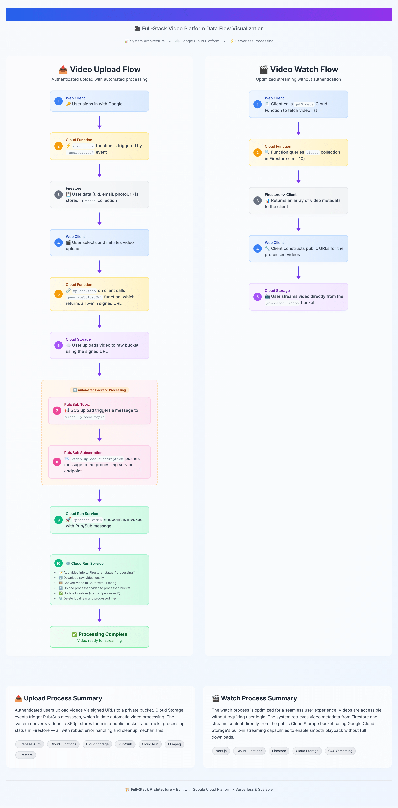

# YouTube Clone

A serverless video sharing platform built on Google Cloud Platform that enables authenticated users to upload videos, automatically processes them to 360p resolution, and allows public streaming without using YouTube APIs directly.

## Tech Stack

- **Frontend**: Next.js with TypeScript (deployed via Cloud Run)
- **Backend API**: Firebase Cloud Functions (Node.js with Express.js: `yt-api-service`)
- **Video Processing**: FFmpeg on Cloud Run (`video-processing-service`)
- **Database**: Cloud Firestore
- **Storage**: Google Cloud Storage
- **Messaging**: Google Cloud Pub/Sub
- **Serverless**: Google Cloud Run & Cloud Functions (aka FireBase Functions)
- **Authentication**: Firebase Auth with Google Sign-In
- **Containers**: Google Artifact Registry (Docker containers)

## Architecture

The system follows an event-driven microservices architecture with three main components:

### 1. Video Processing Service (Cloud Run + FFmpeg)

Express.js server that processes video uploads triggered by Pub/Sub messages. Downloads raw videos, converts them to 360p using FFmpeg, uploads processed videos to public storage, and manages processing status in Firestore with automatic cleanup.

### 2. API Service (Cloud Functions)

Three Firebase functions handle core operations:

- `generateUploadUrl`: Creates time-limited signed URLs for authenticated uploads
- `getVideos`: Retrieves video metadata from Firestore (limit 10)
- `createUser`: Auto-creates user profiles when Firebase Auth accounts are created

### 3. Web Client (Next.js)

Frontend application with Google authentication, video upload via signed URLs, and streaming interface for public videos.

### Storage Architecture

- **Raw Videos Bucket**: Private storage for original uploads, triggers Pub/Sub on file creation
- **Processed Videos Bucket**: Public storage for 360p converted videos with streaming capabilities

### Database Schema (Firestore)

**Users Collection**: `{uid, email, photoURL}` - Auto-populated via Auth triggers  
**Videos Collection**: `{id, uid, title?, filename, description?, status}` - Manual management with processing states

### Messaging Flow

`video-uploads-topic` receives storage events → `video-uploads-subscription` pushes to processing service → Video converted and metadata updated

## Data Flow

[](DataFlow.pdf)

## Project Structure

```
youtube-clone/
├── utils/
│   └── gcs-cors.json            # CORS configurations for raw bucket
├── video-processing-service/     # Cloud Run service
│   ├── src/
│   │   ├── index.ts             # Express server with /process-video endpoint
│   │   ├── storage.ts           # GCS operations and FFmpeg processing
│   │   └── firestore.ts         # Database operations and Video interface
│   └── Dockerfile               # Container configuration
├── yt-api-service/              # Firebase Cloud Functions
│   └── functions/
│       └── src/
│           └── index.ts         # generateUploadUrl, getVideos, createUser
└── yt-web-client/               # Next.js frontend
    ├── app/
    │   ├── firebase/
    │   │   ├── firebase.ts      # Firebase config and auth helpers
    │   │   └── functions.ts     # Client-side API functions
    │   ├── navbar/              # Navigation components
    │   └── watch/               # Video player components
    ├── public/                  # Static assets
    └── Dockerfile               # Container configuration
```

## Key Features

- 🔐 **Google Authentication** using Sign-in-with-Google
- 📤 **Authenticated video uploads** via signed URLs
- 🧠 **FFmpeg video processing** (360p) using Cloud Run
- ☁️ **Cloud Storage integration** for raw and processed videos
- 📡 **Pub/Sub pipeline** for asynchronous processing
- 🔄 **Video metadata storage** in Firestore (status, uploader, filename)
- 📺 **Public streaming access** to processed videos for any user
- ⚙️ **REST API service** using Cloud Functions for CRUD operations
- 🐳 **Dockerized services** pushed to Artifact Registry
